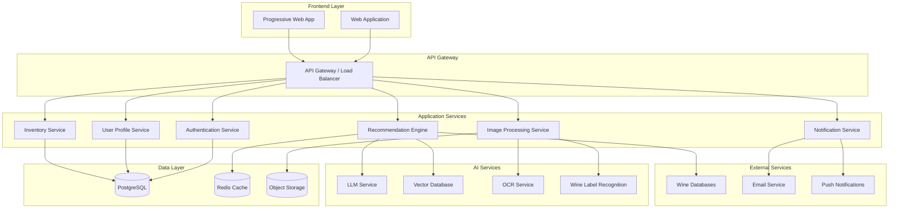

# Design Document

## Overview

Pourtrait is designed as a modern, AI-powered wine management and recommendation platform that serves users across all experience levels. The system combines a responsive web application frontend with an intelligent backend that leverages machine learning, external wine databases, and image recognition to provide personalized wine experiences.

The architecture follows a microservices approach with clear separation between user interface, business logic, AI services, and data management. This design ensures scalability, maintainability, and the ability to iterate quickly on AI capabilities while maintaining a stable user experience.

## Architecture

### High-Level System Architecture



### Technology Stack

**Frontend:**
- React 18 with TypeScript for type safety and modern development
- Tailwind CSS for responsive, mobile-first styling
- Progressive Web App (PWA) capabilities for mobile app-like experience
- React Query for efficient data fetching and caching
- Camera API integration for image capture

**Backend:**
- Node.js with Express.js for API services
- TypeScript for consistent type safety across the stack
- PostgreSQL for relational data storage
- Redis for caching and session management
- AWS S3 or similar for image storage

**AI & ML:**
- OpenAI GPT-4 or similar LLM for conversational AI
- Pinecone or Weaviate for vector embeddings storage
- Google Vision API or AWS Rekognition for OCR
- Custom wine label recognition service (potentially using Roboflow or similar)

**Infrastructure & Production Deployment:**
- **Option 1 - Supabase + Vercel Stack:**
  - Supabase for PostgreSQL database, authentication, and real-time features
  - Vercel for frontend deployment with edge functions for API routes
  - Vercel's built-in CDN and performance optimization
  - Supabase Edge Functions for AI service integration
- **Option 2 - Firebase + Vercel Stack:**
  - Firebase for NoSQL database, authentication, and cloud functions
  - Vercel for frontend deployment and API routes
  - Firebase Cloud Storage for images
  - Firebase Cloud Functions for AI processing
- **Option 3 - Traditional Cloud (AWS/GCP/Azure):**
  - Docker containers for service deployment
  - Managed database services (RDS, Cloud SQL, etc.)
  - CDN for static asset delivery
  - Monitoring with DataDog or similar

**Recommended Approach: Supabase + Vercel**
- Fastest time to production with minimal DevOps overhead
- Built-in authentication and real-time capabilities
- Excellent TypeScript support and developer experience
- Cost-effective scaling for MVP to production
- Easy integration with AI services via edge functions

## Components and Interfaces

### Frontend Components

#### Core Layout Components
- **AppShell**: Main application wrapper with navigation
- **BottomNavigation**: Mobile-first navigation bar
- **Header**: Context-aware header with search and user actions

#### Feature Components
- **WineInventory**: Grid/list view of user's wine collection
- **WineCard**: Individual wine display with image, details, and actions
- **AIChat**: Conversational interface for sommelier interactions
- **CameraCapture**: Wine label scanning interface
- **TasteProfileQuiz**: Interactive onboarding and profile building
- **RecommendationCard**: AI-generated wine suggestions with explanations
- **DrinkingWindowAlert**: Visual indicators for wine readiness

#### Utility Components
- **ImageUpload**: Drag-and-drop and camera integration
- **LoadingStates**: Skeleton screens and progress indicators
- **ErrorBoundary**: Graceful error handling and recovery
- **OfflineIndicator**: PWA offline status management
- **IconSystem**: Professional icon library integration (Feather, Heroicons, etc.)

#### Design System Guidelines
- **No Emojis Policy**: Strict prohibition on emoji usage throughout the application
- **Professional Icons**: Use established icon libraries (Feather Icons, Heroicons, Lucide) for all visual elements
- **Typography**: Clean, professional typography that conveys expertise and trustworthiness
- **Color Palette**: Sophisticated wine-inspired colors used sparingly and professionally

### Backend Service Interfaces

#### User Profile Service
```typescript
interface UserProfileService {
  createProfile(userData: UserRegistration): Promise<User>
  updateTasteProfile(userId: string, preferences: TastePreferences): Promise<void>
  getTasteProfile(userId: string): Promise<TasteProfile>
  addDrinkingPartner(userId: string, partnerProfile: PartnerProfile): Promise<void>
}
```

#### Inventory Service
```typescript
interface InventoryService {
  addWine(userId: string, wineData: WineInput): Promise<Wine>
  updateWine(wineId: string, updates: Partial<Wine>): Promise<Wine>
  getInventory(userId: string, filters?: InventoryFilters): Promise<Wine[]>
  markConsumed(wineId: string, rating?: number, notes?: string): Promise<void>
  getConsumptionHistory(userId: string): Promise<ConsumptionRecord[]>
}
```

#### Recommendation Engine
```typescript
interface RecommendationEngine {
  getPersonalizedRecommendations(userId: string, context?: RecommendationContext): Promise<Recommendation[]>
  getFoodPairings(userId: string, foodDescription: string, inventory?: boolean): Promise<PairingRecommendation[]>
  analyzeRestaurantList(userId: string, wineListImage: string, foodContext?: string): Promise<RestaurantRecommendation[]>
  processNaturalLanguageQuery(userId: string, query: string): Promise<AIResponse>
}

interface AIResponseGuidelines {
  tone: 'professional' | 'educational' | 'approachable'
  noEmojis: true
  sommelierStyle: boolean
  experienceLevel: 'beginner' | 'intermediate' | 'advanced'
}
```

#### Image Processing Service
```typescript
interface ImageProcessingService {
  recognizeWineLabel(imageBuffer: Buffer): Promise<WineRecognitionResult>
  extractTextFromImage(imageBuffer: Buffer): Promise<OCRResult>
  processWineListImage(imageBuffer: Buffer): Promise<WineListExtraction>
  optimizeAndStoreImage(imageBuffer: Buffer): Promise<string>
}
```

#### Drinking Window Service
```typescript
interface DrinkingWindowService {
  calculateDrinkingWindow(wine: Partial<Wine>): DrinkingWindow
  updateDrinkingWindowStatus(drinkingWindow: DrinkingWindow): DrinkingWindow
  getWinesNeedingAlerts(wines: Wine[]): DrinkingWindowAlerts
  getDrinkingUrgencyScore(wine: Wine): number
  getDrinkingWindowDataSource(wine: Partial<Wine>): DataSourceInfo
}

interface DrinkingWindowAlerts {
  enteringPeak: Wine[]
  leavingPeak: Wine[]
  overHill: Wine[]
}

interface DataSourceInfo {
  source: string
  confidence: number
  isExpertData: boolean
}
```

**Hybrid Data Approach:**
The drinking window system uses a sophisticated hybrid approach combining:

1. **Expert-Curated Data** (95% confidence)
   - Wine Spectator, Robert Parker, Jancis Robinson, Decanter
   - Specific producer data for premium wines
   - Regional aging patterns from wine experts

2. **External Wine Database Integration** (90% confidence)
   - Wine APIs (Vivino, Wine.com, CellarTracker)
   - Professional wine databases
   - Stored in `wine.externalData.agingPotential`

3. **Algorithmic Calculation** (60% confidence)
   - Rule-based system for unknown wines
   - Based on wine type, region, vintage
   - Graceful fallback ensuring universal coverage

#### Expert Drinking Window Service
```typescript
interface ExpertDrinkingWindowService {
  findExpertData(wine: WineIdentifier): ExpertDrinkingWindowData | null
  getRegionalPattern(region: string): RegionalAgingPattern | null
  getVarietalPattern(varietals: string[]): VarietalAgingPattern | null
  calculateExpertAgingPotential(wine: WineIdentifier): ExpertAgingResult | null
}

interface ExpertDrinkingWindowData {
  producer: string
  wine?: string
  vintage?: number
  region: string
  varietal?: string[]
  drinkingWindow: {
    earliest: number
    peakStart: number
    peakEnd: number
    latest: number
  }
  source: string
  confidence: number
}
```

#### Notification Service
```typescript
interface NotificationService {
  generateDrinkingWindowAlerts(userId: string, wines: Wine[], settings: NotificationSettings): Promise<DrinkingWindowAlert[]>
  createNotification(userId: string, alert: DrinkingWindowAlert): Promise<void>
  sendEmailAlert(userEmail: string, alerts: DrinkingWindowAlert[]): Promise<void>
  processAllUserAlerts(): Promise<void>
  getUserNotifications(userId: string): Promise<Notification[]>
  markNotificationRead(notificationId: string): Promise<void>
}
```

## Data Models

### Core Data Models

#### User Model
```typescript
interface User {
  id: string
  email: string
  name: string
  createdAt: Date
  updatedAt: Date
  onboardingCompleted: boolean
  experienceLevel: 'beginner' | 'intermediate' | 'advanced'
  preferences: UserPreferences
}

interface UserPreferences {
  language: string
  notifications: NotificationSettings
  privacy: PrivacySettings
}
```

#### Taste Profile Model
```typescript
interface TasteProfile {
  userId: string
  redWinePreferences: FlavorProfile
  whiteWinePreferences: FlavorProfile
  sparklingPreferences: FlavorProfile
  generalPreferences: GeneralPreferences
  learningHistory: TastingRecord[]
  confidenceScore: number
  lastUpdated: Date
}

interface FlavorProfile {
  fruitiness: number // 1-10 scale
  earthiness: number
  oakiness: number
  acidity: number
  tannins: number
  sweetness: number
  body: 'light' | 'medium' | 'full'
  preferredRegions: string[]
  preferredVarietals: string[]
  dislikedCharacteristics: string[]
}
```

#### Wine Model
```typescript
interface Wine {
  id: string
  userId: string
  name: string
  producer: string
  vintage: number
  region: string
  country: string
  varietal: string[]
  type: 'red' | 'white' | 'rosé' | 'sparkling' | 'dessert' | 'fortified'
  quantity: number
  purchasePrice?: number
  purchaseDate?: Date
  drinkingWindow: DrinkingWindow
  personalRating?: number
  personalNotes?: string
  imageUrl?: string
  externalData: ExternalWineData
  createdAt: Date
  updatedAt: Date
}

interface DrinkingWindow {
  earliestDate: Date
  peakStartDate: Date
  peakEndDate: Date
  latestDate: Date
  currentStatus: 'too_young' | 'ready' | 'peak' | 'declining' | 'over_hill'
}
```

#### Recommendation Model
```typescript
interface Recommendation {
  id: string
  userId: string
  type: 'inventory' | 'purchase' | 'pairing'
  wineId?: string // For inventory recommendations
  suggestedWine?: WineSuggestion // For purchase recommendations
  context: RecommendationContext
  reasoning: string
  confidence: number
  createdAt: Date
  userFeedback?: 'accepted' | 'rejected' | 'modified'
}

interface RecommendationContext {
  occasion?: string
  foodPairing?: string
  priceRange?: PriceRange
  urgency?: 'low' | 'medium' | 'high'
  companions?: string[]
}
```

### Database Schema Design

**Supabase PostgreSQL Schema:**
The database will leverage Supabase's PostgreSQL with Row Level Security (RLS) for data protection:

- **users**: Core user account information (managed by Supabase Auth)
- **taste_profiles**: Detailed preference data with JSONB columns for flexibility
- **wines**: Wine inventory with full-text search capabilities and RLS policies
- **consumption_history**: Tracking of consumed wines and ratings
- **recommendations**: AI-generated suggestions with feedback tracking
- **drinking_partners**: Profiles for frequent companions
- **notifications**: Alert preferences and delivery tracking

**Supabase Features Utilized:**
- Row Level Security (RLS) for data isolation between users
- Real-time subscriptions for live updates
- Built-in authentication with social providers
- Automatic API generation from schema
- Edge Functions for AI service integration

## Error Handling

### Frontend Error Handling

#### Network Errors
- Implement retry logic with exponential backoff
- Show user-friendly offline indicators
- Cache critical data for offline functionality
- Graceful degradation when AI services are unavailable

#### User Input Errors
- Real-time validation with helpful error messages
- Progressive disclosure for complex forms
- Auto-save functionality to prevent data loss
- Clear recovery paths for failed operations

#### AI Service Errors
- Fallback to cached recommendations when AI is unavailable
- Clear communication when AI confidence is low
- Alternative input methods when image recognition fails
- Graceful handling of rate limits and API quotas

### Backend Error Handling

#### Service Communication
```typescript
class ServiceError extends Error {
  constructor(
    public service: string,
    public operation: string,
    public statusCode: number,
    message: string
  ) {
    super(message)
  }
}

class ErrorHandler {
  static handleServiceError(error: ServiceError): APIResponse {
    // Log error for monitoring
    logger.error(`Service ${error.service} failed: ${error.message}`)
    
    // Return appropriate user-facing message
    return {
      success: false,
      error: this.getUserFriendlyMessage(error),
      code: error.statusCode
    }
  }
}
```

#### Data Validation
- Input sanitization and validation at API boundaries
- Database constraint enforcement
- Graceful handling of external API failures
- Comprehensive logging for debugging and monitoring

## Testing Strategy

### Frontend Testing

#### Unit Testing
- Component testing with React Testing Library
- Hook testing for custom React hooks
- Utility function testing with Jest
- Mock external dependencies and API calls

#### Integration Testing
- User flow testing with Cypress or Playwright
- API integration testing
- Camera and image upload functionality testing
- PWA functionality testing

#### Visual Testing
- Storybook for component documentation and testing
- Visual regression testing for UI consistency
- Mobile responsiveness testing across devices
- Accessibility testing with axe-core

### Backend Testing

#### Unit Testing
- Service layer testing with comprehensive mocking
- Database model testing
- AI service integration testing with mock responses
- Utility and helper function testing

#### Integration Testing
- API endpoint testing with supertest
- Database integration testing with test containers
- External service integration testing
- End-to-end workflow testing

#### Performance Testing
- Load testing for AI recommendation endpoints
- Database query performance testing
- Image processing performance benchmarks
- Caching effectiveness testing

### AI/ML Testing

#### Model Performance Testing
- Recommendation accuracy testing with historical data
- A/B testing framework for recommendation algorithms
- Bias detection and fairness testing
- Response time and throughput testing

#### AI Response Quality Testing
- Professional tone validation (no emojis, sommelier-appropriate language)
- Response appropriateness for different experience levels
- Consistency in professional presentation across all AI interactions
- Educational value assessment for beginner-friendly responses

#### Data Quality Testing
- Wine data accuracy validation
- Image recognition accuracy benchmarks
- OCR accuracy testing across different image qualities
- Taste profile learning effectiveness measurement

### Security Testing

#### Authentication & Authorization
- JWT token security testing
- Role-based access control testing
- Session management security
- Password security and reset flow testing

#### Data Protection
- Input sanitization testing
- SQL injection prevention testing
- XSS protection testing
- File upload security testing

#### Privacy Compliance
- Data anonymization testing
- GDPR compliance verification
- Data retention policy enforcement
- User consent management testing

## AI Prompt Engineering & Response Guidelines

### Professional Sommelier Persona
The AI system must maintain a consistent, professional sommelier persona across all interactions:

#### Core Principles
- **No Emojis**: Strict prohibition on emoji usage in all AI responses
- **Professional Tone**: Knowledgeable yet approachable, similar to a professional sommelier
- **Educational Focus**: Responses should teach while recommending
- **Experience-Appropriate**: Adjust complexity based on user's indicated experience level

#### Prompt Templates
```typescript
interface PromptTemplate {
  systemPrompt: string
  userExperienceLevel: 'beginner' | 'intermediate' | 'advanced'
  responseGuidelines: {
    noEmojis: true
    tone: 'professional_sommelier'
    includeEducation: boolean
    vocabularyLevel: 'accessible' | 'intermediate' | 'advanced'
  }
}

const SYSTEM_PROMPT_BASE = `
You are a professional sommelier assistant. Your responses must:
- NEVER use emojis or emoticons
- Use professional, sommelier-appropriate language
- Provide educational context appropriate to the user's experience level
- Be encouraging and supportive, especially for beginners
- Include specific reasoning for recommendations
- Maintain a warm but professional tone
`
```

#### Response Validation
- Automated emoji detection and rejection
- Tone analysis to ensure professional consistency
- Educational value scoring for beginner interactions
- Response length optimization for mobile consumption

## Development & Testing Strategy

### Integrated Testing Approach
- **Test-Driven Development**: Write tests alongside feature implementation
- **Continuous Integration**: Automated testing on every commit
- **Documentation as Code**: Update documentation with each feature
- **Quality Gates**: No feature complete without tests and documentation

### Testing Framework Integration
```typescript
// Example test structure for each feature
describe('TasteProfile', () => {
  describe('creation', () => {
    it('should create profile from quiz responses')
    it('should handle invalid input gracefully')
    it('should generate beginner-friendly explanations')
  })
  
  describe('learning', () => {
    it('should update preferences based on feedback')
    it('should maintain confidence scores')
  })
})
```

## Performance Considerations

### Frontend Optimization (Vercel Deployment)
- Code splitting and lazy loading for faster initial load
- Next.js Image optimization for wine photos
- Vercel Edge Functions for AI API calls
- Efficient state management to minimize re-renders

### Backend Optimization (Supabase)
- Database query optimization with proper indexing
- Supabase caching for frequently accessed data
- AI response caching in Vercel Edge Functions
- Asynchronous processing with Supabase Edge Functions

### Scalability Planning (Production-Ready)
- Vercel's automatic scaling for frontend
- Supabase's managed scaling for database
- CDN implementation via Vercel's global network
- Monitoring with Vercel Analytics and Supabase metrics
## D
ocumentation Standards

### Project Documentation Structure
All project documentation must follow a strict organizational structure and naming convention:

#### Documentation Directory Structure
```
docs/
├── 01-setup/
│   ├── README.md                    # Quick start guide
│   ├── installation.md              # Detailed installation instructions
│   ├── requirements.md              # Technical requirements
│   └── troubleshooting.md           # Common issues and solutions
├── 02-development/
│   ├── README.md                    # Development overview
│   ├── guidelines.md                # Coding standards and practices
│   ├── testing.md                   # Testing strategies and examples
│   └── deployment.md                # Deployment procedures
├── 03-architecture/
│   ├── README.md                    # Architecture overview
│   ├── database-schema.md           # Database design and relationships
│   ├── api-reference.md             # API documentation
│   └── security.md                  # Security considerations
├── 04-features/
│   ├── README.md                    # Feature overview
│   ├── wine-inventory.md            # Wine management features
│   ├── ai-sommelier.md              # AI recommendation system
│   └── user-profiles.md             # User management and preferences
└── 05-operations/
    ├── README.md                    # Operations overview
    ├── monitoring.md                # System monitoring and alerts
    ├── backup-recovery.md           # Data backup and recovery
    └── performance.md               # Performance optimization
```

#### Naming Conventions
- **File Names**: Use kebab-case (lowercase with hyphens): `wine-inventory.md`
- **Directory Names**: Use numbered prefixes for ordering: `01-setup/`, `02-development/`
- **Document Titles**: Use title case: "Wine Inventory Management"
- **Section Headers**: Use sentence case: "Database schema design"

#### Document Standards
- **Format**: All documentation in Markdown (.md) format
- **Structure**: Each document must have a clear hierarchy with H1, H2, H3 headers
- **Code Examples**: Use proper syntax highlighting with language tags
- **Links**: Use relative links for internal documentation
- **Images**: Store in `docs/assets/images/` with descriptive names

#### Required Sections
Each major document must include:
1. **Overview**: Brief description of the topic
2. **Prerequisites**: What the reader needs to know/have
3. **Step-by-step Instructions**: Clear, numbered steps
4. **Examples**: Code examples or screenshots where applicable
5. **Troubleshooting**: Common issues and solutions
6. **Next Steps**: What to do after completing this document

#### Root Directory Cleanup
The project root should only contain:
- **Essential Configuration Files**: package.json, tsconfig.json, etc.
- **Single README.md**: Points to docs/ directory
- **Setup Scripts**: Automated setup tools
- **No Scattered Documentation**: All docs moved to docs/ directory

### Documentation Maintenance
- **Version Control**: All documentation changes tracked in git
- **Review Process**: Documentation changes require review
- **Update Triggers**: Documentation updated with each feature change
- **Validation**: Automated checks for broken links and formatting

## Performance Considerations

### Frontend Optimization (Vercel Deployment)
- Code splitting and lazy loading for faster initial load
- Next.js Image optimization for wine photos
- Vercel Edge Functions for AI API calls
- Efficient state management to minimize re-renders

### Backend Optimization (Supabase)
- Database query optimization with proper indexing
- Supabase caching for frequently accessed data
- AI response caching in Vercel Edge Functions
- Asynchronous processing with Supabase Edge Functions

### Scalability Planning (Production-Ready)
- Vercel's automatic scaling for frontend
- Supabase's managed scaling for database
- CDN implementation via Vercel's global network
- Monitoring with Vercel Analytics and Supabase metrics