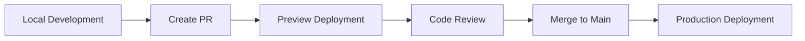

# Deployment Guide

Deployment procedures and CI/CD configuration for Pourtrait.

## Deployment Strategy

### Environments
- **Development**: Local development with hot reload
- **Preview**: Vercel preview deployments for pull requests
- **Production**: Vercel production deployment from main branch

### Deployment Flow


## Vercel Deployment

### Automatic Deployment
Vercel automatically deploys:
- **Production**: Every push to `main` branch
- **Preview**: Every pull request

### Manual Deployment
```bash
# Install Vercel CLI
npm install -g vercel

# Deploy to preview
vercel

# Deploy to production
vercel --prod
```

### Environment Variables
Configure in Vercel dashboard or via CLI:

```bash
# Set environment variables
vercel env add NEXT_PUBLIC_SUPABASE_URL
vercel env add NEXT_PUBLIC_SUPABASE_ANON_KEY
vercel env add SUPABASE_SERVICE_ROLE_KEY
vercel env add OPENAI_API_KEY
```

## CI/CD Pipeline

### GitHub Actions
Located in `.github/workflows/ci.yml`:

```yaml
name: CI

on:
  push:
    branches: [ main, develop ]
  pull_request:
    branches: [ main, develop ]

jobs:
  test:
    runs-on: ubuntu-latest
    
    steps:
    - uses: actions/checkout@v4
    
    - name: Setup Node.js
      uses: actions/setup-node@v4
      with:
        node-version: '18'
        cache: 'npm'
    
    - name: Install dependencies
      run: npm ci
    
    - name: Run type checking
      run: npm run type-check
    
    - name: Run linting
      run: npm run lint
    
    - name: Run tests
      run: npm run test
    
    - name: Build application
      run: npm run build
```

### Quality Gates
All checks must pass before deployment:
- ✅ TypeScript compilation
- ✅ ESLint checks
- ✅ All tests passing
- ✅ Successful build

## Pre-deployment Checklist

### Code Quality
```bash
# Run all quality checks
npm run type-check    # TypeScript errors
npm run lint          # ESLint issues
npm run test          # Test failures
npm run build         # Build errors
```

### Environment Variables
- [ ] All required environment variables set
- [ ] API keys are valid and not expired
- [ ] Database connection working
- [ ] External services accessible

### Performance
- [ ] Bundle size within limits (<500KB total JS)
- [ ] Images optimized (WebP format)
- [ ] Core Web Vitals targets met
- [ ] Lighthouse scores >90

### Security
- [ ] No secrets in code
- [ ] Environment variables properly configured
- [ ] API endpoints secured
- [ ] Authentication working

## Database Migrations

### Supabase Migrations
```bash
# Create migration
supabase migration new add_wine_table

# Apply migrations locally
supabase db reset

# Deploy to production
supabase db push
```

### Migration Checklist
- [ ] Migration tested locally
- [ ] Backup created before deployment
- [ ] Migration is reversible
- [ ] No breaking changes to existing data

## Monitoring and Rollback

### Monitoring
- **Vercel Analytics**: Built-in performance monitoring
- **Error Tracking**: Console errors and exceptions
- **Uptime Monitoring**: Health check endpoints

### Health Checks
```typescript
// pages/api/health.ts
export default function handler(req: NextApiRequest, res: NextApiResponse) {
  // Check database connection
  // Check external services
  // Return status
  
  res.status(200).json({
    status: 'healthy',
    timestamp: new Date().toISOString(),
    services: {
      database: 'connected',
      ai: 'available'
    }
  })
}
```

### Rollback Procedure
If deployment issues occur:

1. **Immediate Rollback**:
   ```bash
   # Rollback to previous deployment
   vercel rollback
   ```

2. **Fix and Redeploy**:
   ```bash
   # Fix the issue
   git revert <commit-hash>
   git push origin main
   ```

3. **Database Rollback** (if needed):
   ```bash
   # Restore from backup
   supabase db restore <backup-id>
   ```

## Performance Optimization

### Build Optimization
```javascript
// next.config.js
module.exports = {
  // Enable compression
  compress: true,
  
  // Optimize images
  images: {
    formats: ['image/webp', 'image/avif'],
    deviceSizes: [640, 750, 828, 1080, 1200, 1920, 2048, 3840],
  },
  
  // Bundle analyzer
  webpack: (config, { isServer }) => {
    if (!isServer) {
      config.resolve.fallback.fs = false
    }
    return config
  }
}
```

### Caching Strategy
- **Static Assets**: Cached at CDN level
- **API Responses**: Cache with appropriate TTL
- **Database Queries**: Use Supabase caching
- **AI Responses**: Cache frequent recommendations

## Security Considerations

### Environment Security
- Use Vercel's encrypted environment variables
- Rotate API keys regularly
- Implement proper CORS policies
- Use HTTPS everywhere

### API Security
```typescript
// Middleware for API routes
export function withAuth(handler: NextApiHandler) {
  return async (req: NextApiRequest, res: NextApiResponse) => {
    // Verify JWT token
    const token = req.headers.authorization?.replace('Bearer ', '')
    
    if (!token || !verifyToken(token)) {
      return res.status(401).json({ error: 'Unauthorized' })
    }
    
    return handler(req, res)
  }
}
```

## Troubleshooting Deployments

### Common Issues

#### Build Failures
```bash
# Check build logs
vercel logs <deployment-url>

# Local build test
npm run build
```

#### Environment Variable Issues
```bash
# List environment variables
vercel env ls

# Pull environment variables locally
vercel env pull .env.local
```

#### Database Connection Issues
- Verify Supabase project is active
- Check connection strings
- Verify RLS policies

### Debug Mode
```bash
# Deploy with debug information
vercel --debug

# View function logs
vercel logs --follow
```

## Next Steps

After successful deployment:
- Monitor application performance
- Set up alerts for errors
- Review and optimize based on usage patterns
- Plan for scaling as user base grows

For operational procedures, see [../05-operations/README.md](../05-operations/README.md).