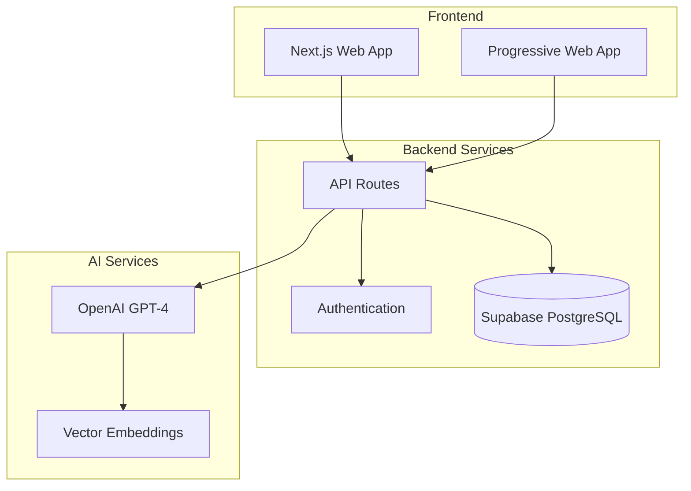

# Architecture Documentation

This directory contains technical architecture documentation for Pourtrait.

## Overview

Pourtrait uses a modern, scalable architecture built on Next.js, Supabase, and Vercel with AI services integration.

## Documents in this section

- **[database-schema.md](./database-schema.md)** - Database design and relationships
- **[api-reference.md](./api-reference.md)** - API endpoints and specifications
- **[security.md](./security.md)** - Security architecture and considerations

## Architecture Highlights

- **Frontend**: Next.js 14 with TypeScript and Tailwind CSS
- **Backend**: Supabase PostgreSQL with Row Level Security
- **AI Services**: OpenAI GPT-4 integration
- **Deployment**: Vercel with edge functions
- **Authentication**: Supabase Auth with JWT tokens

## System Architecture

## Next Steps

- For database design, see [database-schema.md](./database-schema.md)
- For API documentation, see [api-reference.md](./api-reference.md)
- For security details, see [security.md](./security.md)