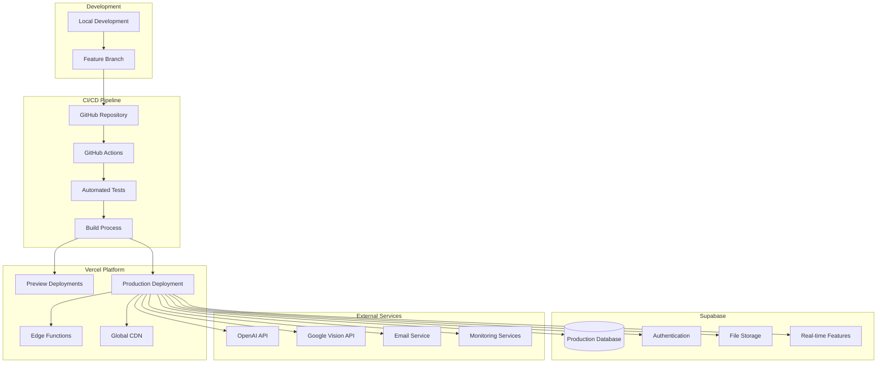

# Production Deployment Guide

## Overview

This guide covers the complete production deployment process for Pourtrait using Vercel and Supabase. The deployment follows a GitOps approach with automated CI/CD pipelines and comprehensive monitoring.

## Prerequisites

- Vercel account with team access
- Supabase production project
- Domain name (optional but recommended)
- Environment variables configured
- GitHub repository with proper access controls

## Deployment Architecture



## Environment Variables Configuration

### Required Environment Variables

Create these environment variables in your Vercel project settings:

#### Supabase Configuration
```bash
NEXT_PUBLIC_SUPABASE_URL=https://your-project.supabase.co
NEXT_PUBLIC_SUPABASE_ANON_KEY=your_anon_key_here
SUPABASE_SERVICE_ROLE_KEY=your_service_role_key_here
```

#### AI Services
```bash
OPENAI_API_KEY=sk-your_openai_api_key_here
PINECONE_API_KEY=your_pinecone_api_key_here
PINECONE_ENVIRONMENT=your_pinecone_environment
PINECONE_INDEX_NAME=wine-recommendations
```

#### Image Processing
```bash
GOOGLE_VISION_API_KEY=your_google_vision_api_key_here
GOOGLE_APPLICATION_CREDENTIALS_JSON={"type":"service_account",...}
```

#### External Wine Data
```bash
WINE_API_KEY=your_wine_database_api_key_here
VIVINO_API_KEY=your_vivino_api_key_here (optional)
```

#### Email & Notifications
```bash
RESEND_API_KEY=re_your_resend_api_key_here
VAPID_PUBLIC_KEY=your_vapid_public_key_here
VAPID_PRIVATE_KEY=your_vapid_private_key_here
```

#### Security & Monitoring
```bash
NEXTAUTH_SECRET=your_nextauth_secret_here
NEXTAUTH_URL=https://your-domain.com
CRON_SECRET=your_cron_secret_here
SENTRY_DSN=your_sentry_dsn_here (optional)
```

#### Application Configuration
```bash
NODE_ENV=production
NEXT_PUBLIC_APP_URL=https://your-domain.com
NEXT_PUBLIC_APP_NAME=Pourtrait
NEXT_PUBLIC_VERCEL_ENV=production
```

### Environment Variable Security

1. **Never commit secrets to version control**
2. **Use Vercel's encrypted environment variables**
3. **Rotate keys regularly**
4. **Use different keys for preview and production**
5. **Implement proper access controls**

## Vercel Project Configuration

### 1. Project Setup

```bash
# Install Vercel CLI
npm i -g vercel

# Login to Vercel
vercel login

# Link project to Vercel
vercel link

# Set environment variables
vercel env add NEXT_PUBLIC_SUPABASE_URL
vercel env add SUPABASE_SERVICE_ROLE_KEY
# ... add all other environment variables
```

### 2. Build Configuration

The project uses the following build settings:

- **Framework Preset**: Next.js
- **Build Command**: `npm run build`
- **Output Directory**: `.next` (automatic)
- **Install Command**: `npm ci`
- **Development Command**: `npm run dev`

### 3. Domain Configuration

```bash
# Add custom domain
vercel domains add your-domain.com

# Configure DNS
# Add CNAME record: your-domain.com -> cname.vercel-dns.com
```

## Deployment Process

### 1. Automated Deployment

Every push to the main branch triggers an automatic deployment:

1. **Code Push**: Developer pushes to main branch
2. **Build Trigger**: Vercel detects changes and starts build
3. **Environment Setup**: Loads production environment variables
4. **Dependency Installation**: Runs `npm ci`
5. **Type Checking**: Runs TypeScript compilation
6. **Testing**: Executes test suite
7. **Build Process**: Runs `npm run build`
8. **Deployment**: Deploys to Vercel's global CDN
9. **Health Check**: Verifies deployment health

### 2. Preview Deployments

Every pull request gets a preview deployment:

- Unique URL for testing
- Same environment as production
- Automatic updates on new commits
- Integration with GitHub checks

### 3. Manual Deployment

For emergency deployments:

```bash
# Deploy current branch
vercel --prod

# Deploy specific commit
vercel --prod --force
```

## Database Migration

### Production Database Setup

1. **Create Supabase Production Project**
   ```bash
   # Initialize Supabase project
   npx supabase init
   
   # Link to production project
   npx supabase link --project-ref your-project-ref
   ```

2. **Run Migrations**
   ```bash
   # Apply all migrations to production
   npx supabase db push
   
   # Verify migration status
   npx supabase migration list
   ```

3. **Configure Row Level Security**
   - All RLS policies are included in migrations
   - Verify policies are active in Supabase dashboard
   - Test with different user roles

### Database Backup Strategy

1. **Automated Backups**
   - Supabase provides automatic daily backups
   - Point-in-time recovery available
   - Backup retention: 7 days (Pro plan)

2. **Manual Backup Process**
   ```bash
   # Create manual backup
   npx supabase db dump --file backup-$(date +%Y%m%d).sql
   
   # Store in secure location
   aws s3 cp backup-$(date +%Y%m%d).sql s3://your-backup-bucket/
   ```

## Performance Optimization

### 1. Next.js Optimizations

- **Image Optimization**: Automatic WebP/AVIF conversion
- **Code Splitting**: Automatic route-based splitting
- **Static Generation**: Pre-rendered pages where possible
- **Edge Functions**: AI API calls run on Vercel Edge

### 2. Caching Strategy

- **Static Assets**: Cached at CDN level (1 year)
- **API Responses**: Cached with appropriate TTL
- **Database Queries**: Cached in Redis (Supabase)
- **AI Responses**: Cached for repeated queries

### 3. Bundle Analysis

```bash
# Analyze bundle size
npm run build
npx @next/bundle-analyzer

# Monitor bundle size in CI
npm install --save-dev @next/bundle-analyzer
```

## Security Configuration

### 1. Content Security Policy

```javascript
// next.config.js
const securityHeaders = [
  {
    key: 'Content-Security-Policy',
    value: `
      default-src 'self';
      script-src 'self' 'unsafe-eval' 'unsafe-inline' *.vercel.app;
      style-src 'self' 'unsafe-inline' fonts.googleapis.com;
      img-src 'self' data: blob: *.supabase.co;
      font-src 'self' fonts.gstatic.com;
      connect-src 'self' *.supabase.co api.openai.com;
    `.replace(/\s{2,}/g, ' ').trim()
  }
]
```

### 2. HTTPS Enforcement

- Automatic HTTPS via Vercel
- HSTS headers configured
- Secure cookie settings

### 3. Rate Limiting

```typescript
// Implement rate limiting for API routes
import { Ratelimit } from '@upstash/ratelimit'
import { Redis } from '@upstash/redis'

const ratelimit = new Ratelimit({
  redis: Redis.fromEnv(),
  limiter: Ratelimit.slidingWindow(10, '10 s'),
})
```

## Monitoring Setup

### 1. Vercel Analytics

- Automatic performance monitoring
- Core Web Vitals tracking
- Real User Monitoring (RUM)
- Function execution metrics

### 2. Error Tracking

```bash
# Install Sentry
npm install @sentry/nextjs

# Configure Sentry
# sentry.client.config.js
import * as Sentry from '@sentry/nextjs'

Sentry.init({
  dsn: process.env.SENTRY_DSN,
  environment: process.env.VERCEL_ENV,
})
```

### 3. Custom Metrics

```typescript
// Track custom business metrics
export async function trackWineAddition(userId: string) {
  await fetch('/api/metrics', {
    method: 'POST',
    body: JSON.stringify({
      event: 'wine_added',
      userId,
      timestamp: new Date().toISOString()
    })
  })
}
```

## Health Checks

### 1. Application Health

```typescript
// pages/api/health.ts
export default async function handler(req: NextApiRequest, res: NextApiResponse) {
  try {
    // Check database connection
    const { data, error } = await supabase.from('user_profiles').select('count').limit(1)
    if (error) throw error

    // Check AI service
    const aiHealth = await checkOpenAIHealth()
    
    res.status(200).json({
      status: 'healthy',
      timestamp: new Date().toISOString(),
      services: {
        database: 'healthy',
        ai: aiHealth ? 'healthy' : 'degraded'
      }
    })
  } catch (error) {
    res.status(503).json({
      status: 'unhealthy',
      error: error.message
    })
  }
}
```

### 2. Uptime Monitoring

- Configure external uptime monitoring (UptimeRobot, Pingdom)
- Monitor critical user journeys
- Set up alerting for downtime

## Rollback Procedures

### 1. Automatic Rollback

Vercel provides instant rollback capabilities:

```bash
# List deployments
vercel ls

# Rollback to previous deployment
vercel rollback [deployment-url]
```

### 2. Database Rollback

```bash
# Rollback database migration
npx supabase migration repair --status reverted

# Apply previous migration
npx supabase db reset --linked
```

### 3. Emergency Procedures

1. **Immediate Response**
   - Rollback to last known good deployment
   - Disable problematic features via feature flags
   - Communicate with users via status page

2. **Investigation**
   - Check error logs in Vercel dashboard
   - Review Supabase logs
   - Analyze performance metrics

3. **Resolution**
   - Fix issues in development
   - Deploy hotfix to production
   - Verify fix with monitoring

## Maintenance Windows

### Scheduled Maintenance

1. **Database Maintenance**
   - Supabase handles automatic maintenance
   - Minimal downtime (< 30 seconds)
   - Advance notification via email

2. **Application Updates**
   - Deploy during low-traffic hours
   - Use feature flags for gradual rollout
   - Monitor metrics during deployment

### Emergency Maintenance

1. **Security Updates**
   - Immediate deployment required
   - Follow emergency deployment process
   - Post-deployment verification

2. **Critical Bug Fixes**
   - Hotfix deployment process
   - Minimal testing for critical issues
   - Full testing post-deployment

## Disaster Recovery

### 1. Data Recovery

- **Database**: Supabase automatic backups + manual backups
- **Files**: Supabase Storage with replication
- **Code**: Git repository with multiple remotes

### 2. Service Recovery

- **Vercel**: Multi-region deployment
- **Supabase**: Built-in high availability
- **External APIs**: Fallback mechanisms implemented

### 3. Recovery Testing

- Monthly disaster recovery drills
- Backup restoration testing
- Failover procedure validation

## Compliance & Security

### 1. Data Protection

- GDPR compliance implemented
- Data encryption at rest and in transit
- User data export/deletion capabilities

### 2. Security Audits

- Regular dependency updates
- Security scanning in CI/CD
- Penetration testing (quarterly)

### 3. Access Controls

- Role-based access to production systems
- Multi-factor authentication required
- Audit logging for all administrative actions

## Troubleshooting

### Common Issues

1. **Build Failures**
   - Check environment variables
   - Verify dependency versions
   - Review build logs

2. **Database Connection Issues**
   - Verify Supabase credentials
   - Check connection limits
   - Review RLS policies

3. **Performance Issues**
   - Monitor Core Web Vitals
   - Check function execution times
   - Review database query performance

### Support Contacts

- **Vercel Support**: support@vercel.com
- **Supabase Support**: support@supabase.io
- **Emergency Contact**: [Your team's emergency contact]

## Deployment Checklist

### Pre-Deployment

- [ ] All tests passing
- [ ] Environment variables configured
- [ ] Database migrations ready
- [ ] Performance benchmarks met
- [ ] Security scan completed

### Deployment

- [ ] Deploy to preview environment
- [ ] Run smoke tests
- [ ] Deploy to production
- [ ] Verify health checks
- [ ] Monitor error rates

### Post-Deployment

- [ ] Verify all features working
- [ ] Check performance metrics
- [ ] Monitor error logs
- [ ] Update documentation
- [ ] Notify stakeholders

## Next Steps

After successful deployment:

1. **Monitor Performance**: Watch metrics for first 24 hours
2. **User Feedback**: Collect and address user issues
3. **Optimization**: Identify and implement performance improvements
4. **Documentation**: Update runbooks based on deployment experience